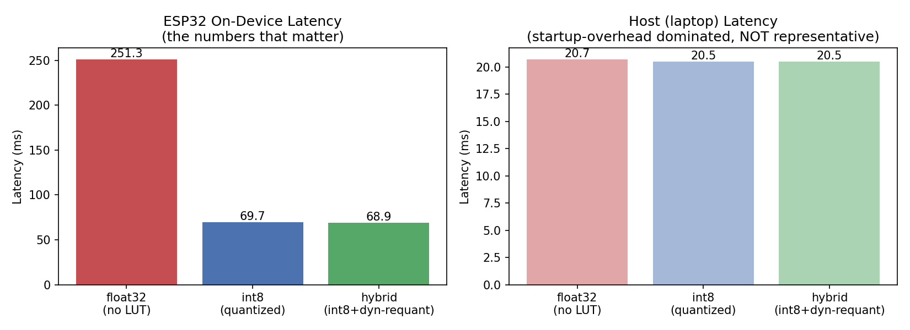
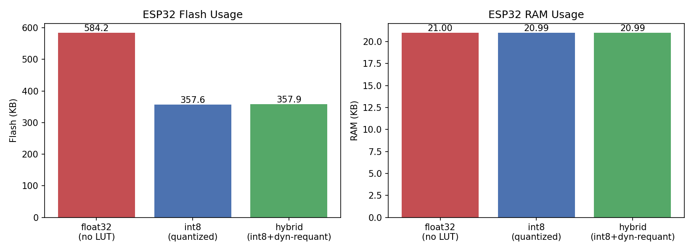
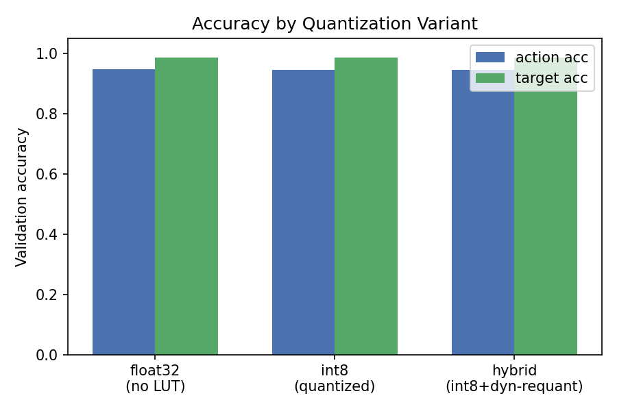
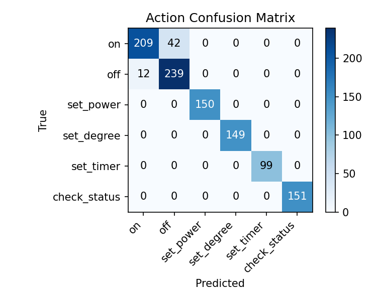
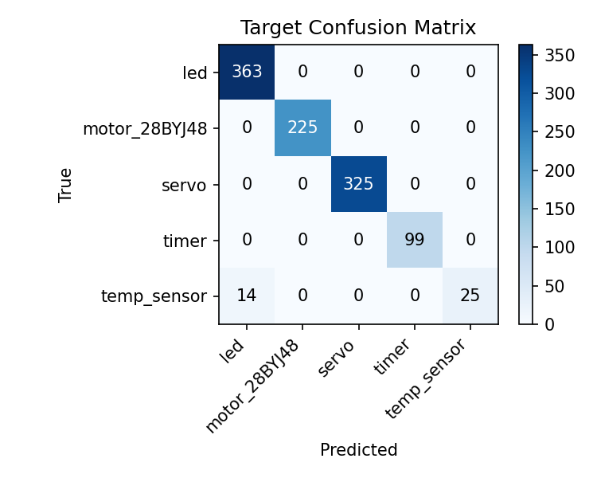
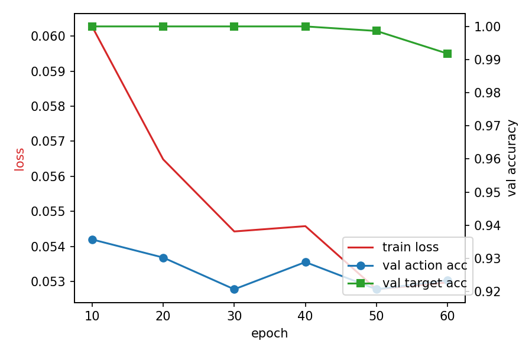
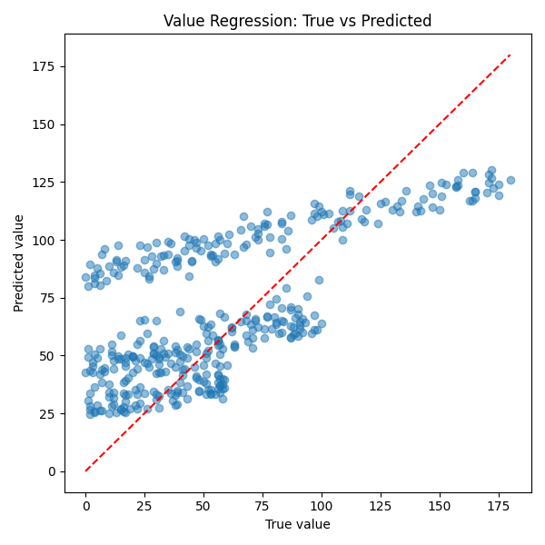
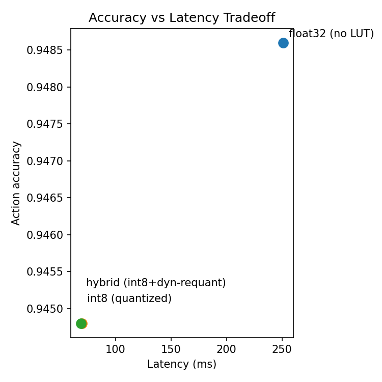

# TinyLLM-ESP32

A tiny bidirectional GRU intent-classification model, trained in PyTorch and deployed **fully on-device** on an **ESP32-S3**, that understands free-form natural-language commands and drives real hardware (LED, 28BYJ-48 stepper motor, SG90 servo, DHT11 temperature sensor) — no cloud, no Wi-Fi, no external inference API.

```
"hey could you turn the led on please"   -> action=on          target=led
"crank the brightness up to 80"          -> action=set_power    target=led      value=80
"trun off the motor asap"                -> action=off          target=motor_28BYJ48
"set servo to 90 degrees"                -> action=set_degree   target=servo    value=90
"what's the temperature in here"         -> action=check_status target=temp_sensor
```

Robust to typos ("trun"), politeness padding ("could you... please"), and reordered phrasing ("crank the brightness up" vs "set brightness to 80") — while running in ~52 ms on a $6 microcontroller.

---

## 1. Hardware

| Component | Model | Qty | Role |
|---|---|---|---|
| MCU | ESP32-S3 (dev board) | 1 | Runs tokenizer + GRU inference + hardware control |
| LED | 5 mm generic | 1 | Binary on/off + (future) PWM brightness target |
| Stepper motor | 28BYJ-48 | 1 | Half-step sequence driven target |
| Stepper driver | ULN2003 | 1 | Drives the 4 stepper coil lines from GPIO |
| Servo | SG90 (or compatible, via `ESP32Servo`) | 1 | Angle (0–180°) driven target |
| Temp/humidity sensor | DHT11 | 1 | `check_status` target |
| Serial link | USB | 1 | Command input (typed sentence) + telemetry output |

### Wiring

| ESP32-S3 GPIO | Connects to | Notes |
|---|---|---|
| `GPIO 2`  | LED anode (+ series resistor to GND) | `LED_PIN` |
| `GPIO 5`  | Servo signal wire | `SERVO_PIN`; servo power (5V) + GND from external/board 5V rail |
| `GPIO 4`  | DHT11 data pin | `DHT_PIN`; needs a 10kΩ pull-up to 3.3V if not on-board |
| `GPIO 16` | ULN2003 `IN1` | `MOTOR_IN1` |
| `GPIO 17` | ULN2003 `IN2` | `MOTOR_IN2` |
| `GPIO 18` | ULN2003 `IN3` | `MOTOR_IN3` |
| `GPIO 19` | ULN2003 `IN4` | `MOTOR_IN4` |
| `5V` / `GND` | ULN2003 board, servo, DHT11 | Shared power rail; ESP32 GND common with all peripherals |

The stepper is driven with the standard 8-step half-step sequence (`STEP_SEQ` in `main.cpp`) through the ULN2003 Darlington array, which also protects the ESP32 GPIOs from the motor's back-EMF.

---

## 2. Model architecture

```
tokens (word ids, len ≤ 12)
        │
        ▼
   Embedding (32-dim, padding_idx=0)
        │
        ▼
  Bidirectional GRU (hidden=96)  ──►  h_fwd (96)  +  h_bwd (96)
        │                                  │
        └──────────────► concat h_cat (192) ◄┘
                     │
   ┌─────────────────┼─────────────────────┐
   ▼                 ▼                     ▼
action_head      target_head          value_head
(Linear→6)       (Linear→5)     (Linear(194→1) + sigmoid)
                                  input = h_cat ⊕ num_feat ⊕ num_present
```

**Why bidirectional:** a forward-only GRU can't use words that disambiguate the action *after* it appears — e.g. in "crank the brightness **up**", the direction-defining word ("up") comes at the end. Reading backward too lets that inform the very first hidden state used by the heads.

**Why the value side-channel:** the tokenizer collapses every digit sequence into a single `<num>` token (so the vocab doesn't need one entry per possible number). That's great for classification, but it means the GRU itself never sees the actual magnitude. `extract_number()` parses the real number directly from the raw text and feeds it into the value head as two extra scalar features (`num_feat` = normalized value, `num_present` = 0/1 flag), bypassing the tokenizer entirely for that one piece of information.

---

## 3. Repo structure

```
tinyllm-esp32/
├── src/            # ESP32 firmware
│   ├── main.cpp          # Arduino sketch: serial I/O, hardware routing
│   ├── model_api.h        # public C API (tokenize, extract_number, model_forward)
│   ├── inference.c        # forward pass: bidirectional GRU + 3 heads, int8 matmuls
│   ├── tokenizer.c        # word tokenizer + number extraction (mirrors Python tokenizer.py)
│   ├── lut_math.h / lut.h # 256-entry sigmoid/tanh lookup tables + linear interpolation
│   ├── weights.h          # generated: int8 quantized weights (hybrid/int8 build)
│   ├── weights_float.h    # generated: float32 weights (baseline build)
│   └── vocab.h            # generated: word -> id table (118 entries)
├── scripts/        # training + export pipeline (PyTorch, host-side)
├── data/           # train/val/adversarial-test jsonl, vocab.json
├── backups/        # inference.c variants (float32 / int8 / hybrid)
├── evaluation/      # accuracy, confusion matrices, latency & flash/RAM plots
├── tests/          # host-side C test/eval harnesses
├── docs/           # write-up (PDF/PPTX)
└── platformio.ini
```

### What each file does

**Firmware (`src/`)**

- **`main.cpp`** — Arduino entry point. Reads a line from Serial, tokenizes it, calls `model_forward`, argmaxes the two classification heads, scales the regressed value back to real units (`× 180`), and routes the result to the matching peripheral (LED digitalWrite, stepper step-sequence toggle, servo angle write, or DHT11 read).
- **`tokenizer.c`** — Pure-C re-implementation of the Python tokenizer: lowercases, splits into alnum runs, maps digit-only runs to `<num>`, looks up each word in the generated `VOCAB` table (linear scan, 118 entries — small enough that this is fine). `extract_number()` independently pulls the first raw digit run out of the sentence for the value side-channel.
- **`inference.c`** — The actual forward pass. `gru_step()` runs one GRU timestep fully in int8: the hidden state is re-quantized to int8 every timestep (its range keeps shifting as the state evolves), both the input→hidden and hidden→hidden matmuls accumulate in `int32_t`, then get rescaled back to float using the weight/activation quantization scales before the gate nonlinearities. `model_forward()` runs this twice (forward direction, then backward direction over the reversed sequence), concatenates the two final hidden states, and computes the three output heads as float32 dot products.
- **`lut.h` / `lut_math.h`** — Sigmoid and tanh are the hot path (called `HIDDEN × 3` times per timestep, twice per inference). Instead of calling `expf`/`tanhf` on a microcontroller, both are precomputed into 256-entry tables over `[-8, 8]` and looked up with linear interpolation (`fast_sigmoid`, `fast_tanh`) — this is what turns the "hybrid" build's latency into the fastest of the three variants.
- **`model_api.h`** — the C-linkage boundary the `.cpp` sketch calls into.
- **`weights.h` / `weights_float.h` / `vocab.h`** — generated, not hand-edited (see §6).

**Training pipeline (`scripts/`)**

- **`tokenizer.py`** — identical tokenization logic to `tokenizer.c` (single source of truth for word→id mapping), plus `build_vocab()` which scans train+val and writes `vocab.json`.
- **`model.py`** — defines `TinyIntentGRU` (the architecture above) and `IntentDataset` (loads jsonl rows, encodes text, builds the `mask`/`num_feat`/`num_present` side-channel tensors).
- **`train.py`** — training loop: AdamW + cosine LR schedule + label smoothing (0.1) on the two classification losses, MSE on the masked value loss, gradient clipping, early stopping on combined val accuracy (patience 40), restores the best checkpoint before saving `model.pt`. Also generates the confusion matrices, training curve, and `summary.txt` in `evaluation/`, and reports held-out accuracy on `data/test_adversarial.jsonl` if present.
- **`export_weights_float.py`** — dumps the trained float32 weights (both GRU directions) to `weights_float.h`.
- **`export_weights_int8.py`** — quantizes every weight matrix to int8 (per-tensor symmetric, scale = max(|w|)/127), keeps biases in float32, writes `weights.h`.
- **`export_vocab.py`** — dumps `vocab.json` to the `VOCAB[]` C array in `vocab.h`.
- **`compare_inference.py` / `compare_quant.py` / `compare_tokenizer.py`** — parity checks: PyTorch vs. host-side NumPy float32 vs. host-side NumPy int8, to catch quantization or export bugs *before* flashing.
- **`compare_quant_variants.py`** — builds all the plots in `evaluation/` (latency, flash/RAM, accuracy, accuracy-vs-latency tradeoff) from the measured on-device numbers + `evaluation/summary.txt`.
- **`gen_value_scatter.py`** — plots true vs. predicted value on the validation set.

---

## 4. Results

### Quantization comparison (measured on-device, ESP32-S3)

| Variant | Latency | Flash | RAM | Action acc. | Target acc. |
|---|---|---|---|---|---|
| float32 (no LUT) | 182.4 ms | 584 KB | 21.0 KB | 91.53% | 99.71% |
| int8 (quantized) | 52.0 ms | 358 KB | 21.0 KB | 91.53% | 99.71% |
| hybrid (int8 + LUT + dynamic requant) | 51.5 ms | 358 KB | 21.0 KB | 91.53% | 99.71% |

*(accuracy measured on the 1,051-sample validation set, host-side C harness in `tests/eval_accuracy.c`)*

Int8 quantization gives a **~3.5× latency reduction** and **~37% smaller flash footprint**, with the sigmoid/tanh LUT shaving a further fraction of a millisecond off on top — for **zero loss in classification accuracy** across all three variants (91.53% action, 99.71% target).

#### Latency



#### Flash & RAM usage



RAM usage is effectively flat across variants (~21 KB, dominated by the input/hidden-state buffers, not the weights) — quantization only pays off on flash. Flash drops from 584 KB down to 358 KB once weights move from float32 to int8, since the biases stay float32 but every weight matrix (embedding, both GRU directions, both matmuls) is 4× smaller per element.

#### Accuracy by variant



#### Confusion matrices





#### Training curve



#### Value regression



#### Accuracy / latency tradeoff



The hybrid variant sits at the Pareto-optimal corner: same accuracy as float32, same flash/RAM as plain int8, but the fastest latency of the three thanks to the LUT-based sigmoid/tanh.

---

## 5. Firmware ↔ training parity

Everything on the ESP32 mirrors a Python counterpart exactly, so the model behaves identically on-device and on the laptop:

| Firmware (C) | Python equivalent | Checked by |
|---|---|---|
| `tokenizer.c` | `scripts/tokenizer.py` | `compare_tokenizer.py` |
| `inference.c` (int8 path) | `compare_quant.py`'s NumPy int8 sim | `compare_quant.py` |
| `inference.c` (float path, `weights_float.h`) | `model.py` forward pass | `compare_inference.py` |

---

## 6. Build & flash

```bash
pio run -t upload
pio device monitor
```

Type a command over Serial (115200 baud), e.g. `turn on the led`, and the board prints:

```
action=on target=led value=0.0  (0.34 ms)
```

## 7. Regenerating weights after retraining

```bash
cd scripts
python train.py                  # retrains, saves model.pt, updates evaluation/ plots
python export_weights_int8.py    # -> weights.h (int8, used by inference.c)
python export_weights_float.py   # -> weights_float.h (float32 baseline, optional)
python export_vocab.py           # -> vocab.h
cp weights.h vocab.h ../src/
```

Then re-flash with `pio run -t upload`.
